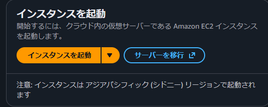
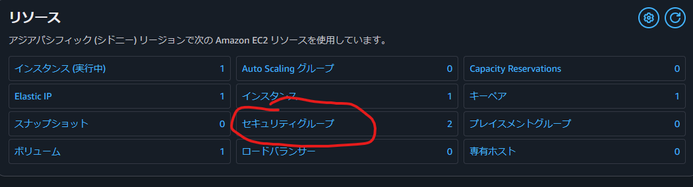
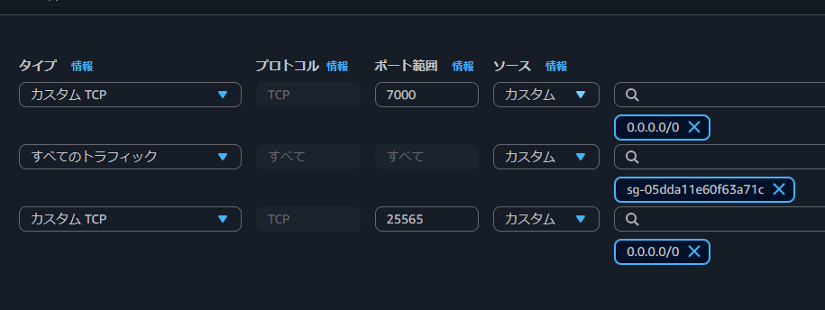

# はじめに

このブログの情報は**2025/11/26時点**のものです。環境が変わる可能性があるので、最新情報を確認してください。

**前提条件:**
- 使用しているホームサーバーのOSは**Ubuntu 24.04.3 LTS**です
- AWSアカウントを作成済み（2025年7月15日以降の新規アカウントは6ヶ月無料プラン注意）
- SSHでホームサーバーに接続可能で、rootかsudoが使える
- Minecraft Javaサーバーがローカル（127.0.0.1:25565）で動いている

## AWSを選んだ理由

- **IPの固定ができる**  
  Elastic IPを作成してインスタンスに関連付ければ、インスタンス再起動してもIPが変わりません。ngrokみたいに毎回変わるストレスゼロ！

- **無料で長期間使える**  
  最近AWS無料枠の仕様が変わり、**2025年7月15日以降の新規アカウントは「Free Plan」（$100クレジット＋追加$100、最大6ヶ月orクレジット枯渇まで）**になりました。旧アカウント（7/15前作成）は従来の12ヶ月継続。 [](grok_render_citation_card_json={"cardIds":["d08b6e"]})  
  とはいえ、EC2 t3.microだけなら仮にかかっても月数百円以内に収まるはず（多分）。請求されても「間違えました！」とサポートに問い合わせれば対応してくれるそうです。

## 1. frpsサーバー用に使うインスタンスを作成

まずは[AWSのEC2ホーム](https://console.aws.amazon.com/ec2/)にアクセスします。

左上の**ダッシュボード**をクリックし、ホーム画面に移動して、真ん中あたりにある**インスタンスの起動**をクリックします。

<!-- 画像: ダッシュボードのスクショ -->


セキュリティグループは後で編集するので、一旦**トラフィックをすべて許可**にしておけば問題ありません。

<!-- 画像: セキュリティグループ初期設定 -->


私はt3.micro (2 vCPU, 1 GiB RAM)にしました。frpならこれで十分だし、無料枠対象で最も安価なので長く使えます。


## 2. AWSの設定

インスタンスが作成できたことを確認したら、同じくダッシュボードへ。

**リソース**エリアの**セキュリティグループ**をクリック。

<!-- 画像: リソースエリア -->


`default`（またはインスタンスに紐づくグループ）をクリック → 下の**インバウンドルール**タブ → **インバウンドルールの編集**。

default以外にグループがある場合も同じ設定を。

以下のルールを追加して保存：

- **TCP 7000** (ソース: 0.0.0.0/0) ← frpc接続用
- **TCP 25565** (ソース: 0.0.0.0/0) ← Minecraftクライアント用

<!-- 画像: インバウンドルール設定 -->


### IPを固定する（Elastic IP）

左メニューの**ネットワーク&セキュリティ** → **Elastic IP**を開く。

右上の**Elastic IPアドレスを割り当て**をクリック → **割り当て**（自動IPv4プールでOK）。

作成したアドレスを選択 → **アクション** → **インスタンスに関連付ける** → あなたのインスタンスを選択 → **関連付け**。

これでIP固定！（再起動しても変わらず無料枠内なら追加料金なし）

## 3. インスタンスにSSH接続してfrpsをインストール

とりあえずupdateとupgradeをします

```bash
sudo apt update && sudo apt upgrade -y
```

### frpのダウンロード

frpをダウンロードして移動します

```bash
wget https://github.com/fatedier/frp/releases/download/v0.60.0/frp_0.60.0_linux_amd64.tar.gz
tar -xzf frp_0.60.0_linux_amd64.tar.gz
cd frp_0.60.0_linux_amd64
```

### 設定ファイルの作成

設定ファイルの中身を変えます

tokenはホームサーバー側と一致させないと行けないので注意してください。

```bash
nano frps.toml
```

```toml
bindPort = 7000  # frpcが接続するポート
auth.method = "token"  # 認証方法
auth.token = "your_secret_token"  # 任意の秘密文字列（ホームサーバー側と同じにする）
```

### frpsを起動

まずは動作するかのテストをします

```bash
./frps -c ./frps.toml
```

エラーが無ければ戻り、バックグラウンドで常駐させるためにsystemdサービスを作成します

```bash
sudo nano /etc/systemd/system/frps.service
```

内容:

```toml
[Unit]
Description=FRP Server Service
After=network.target
[Service]
ExecStart=/path/to/frp/frps -c /path/to/frp/frps.toml  # /path/to/frp は実際のパスに置き換え
Restart=always
User=ubuntu #必要に応じて削除してok
[Install]
WantedBy=multi-user.target
```

適用:

```bash
sudo systemctl daemon-reload && sudo systemctl enable frps && sudo systemctl start frps
```

runningかチェック:

```bash
sudo systemctl status frps
```

これにてAWS側の作業は終了！


## 4.ホームサーバーでfrpcをインストール

さっきとやる事はほぼ一緒です

frpをダウンロードして移動します

AWSの方とバージョンを揃えるようにしてください

```bash
wget https://github.com/fatedier/frp/releases/download/v0.60.0/frp_0.60.0_linux_amd64.tar.gz
tar -xzf frp_0.60.0_linux_amd64.tar.gz
cd frp_0.60.0_linux_amd64
```

### 設定ファイルの作成

```bash
nano frpc.toml
```

内容:

```ini
serverAddr = "AWS_PUBLIC_IP"  # AWSのIPv4アドレス
serverPort = 7000  # frpsのbindPortと同じ
auth.method = "token"
auth.token = "your_secret_token"  # AWSのと揃えてください

[[proxies]]
name = "minecraft"
type = "tcp"  # TCPプロキシ (Minecraft用)
localIP = "127.0.0.1"  # ローカルMinecraftサーバーのIP
localPort = 25565  # Minecraftのポート
remotePort = 25565  # AWS側で公開するポート
```

### frpcの起動

先程と同じように起動テストをします
接続成功のログが出ればOK

```bash
./frpc -c ./frpc.toml
```

バックグラウンドで常駐させるためにsystemdサービスを作成します

```bash
sudo nano /etc/systemd/system/frpc.service
```

内容:

```ini
[Unit]
Description=FRP Client Service
After=network.target

[Service]
ExecStart=/path/to/frp/frpc -c /path/to/frp/frpc.toml # /path/to/frp は実際のパスに置き換え
Restart=always
User=your_user  #必要に応じて削除してok

[Install]
WantedBy=multi-user.target
```

適用:

```bash
sudo systemctl daemon-reload && sudo systemctl enable frpc && sudo systemctl start frpc
```

確認:

```bash
sudo systemctl status frpc
```

## マインクラフトから参加できるか確認

サーバーを起動して割り当てたElasticIP:25565
で参加してみましょう！


# 私は見ました。frp、これにて完成！

これでポート開放なし・IP固定・無料で動くMinecraftサーバーが完成しました

もしこの記事で詰まったり、興味を持ってくれたら是非私のDiscordサーバーに遊びに来てください！ 
実際にこの方法でサーバーを建てたばかりなので、マインクラフトサーバーのメンバーも募集しています！

**Discordサーバー**  
https://discord.gg/djJfFqTGPk

質問・感想・「自分はこうやった！」報告、全部お待ちしてます！
